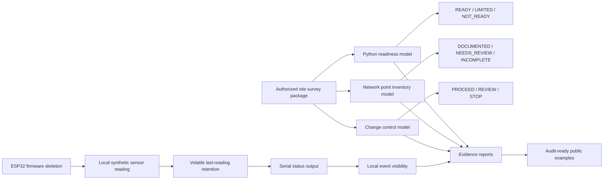
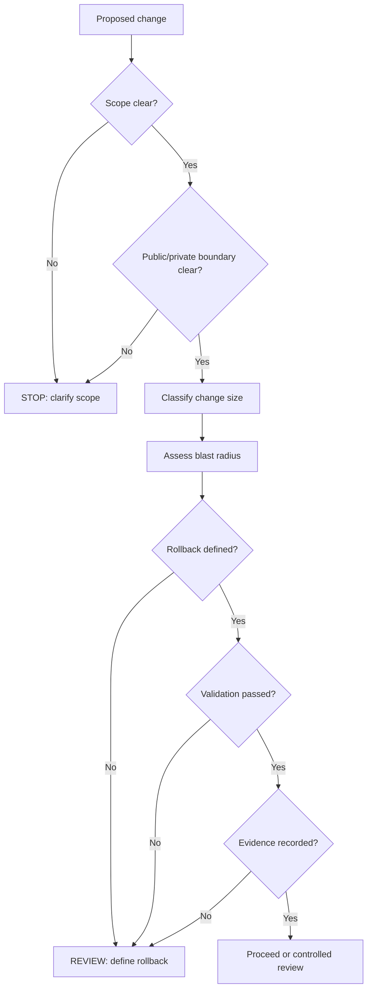
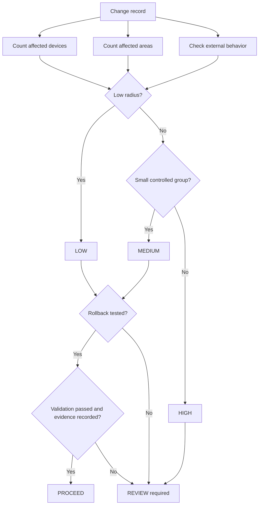
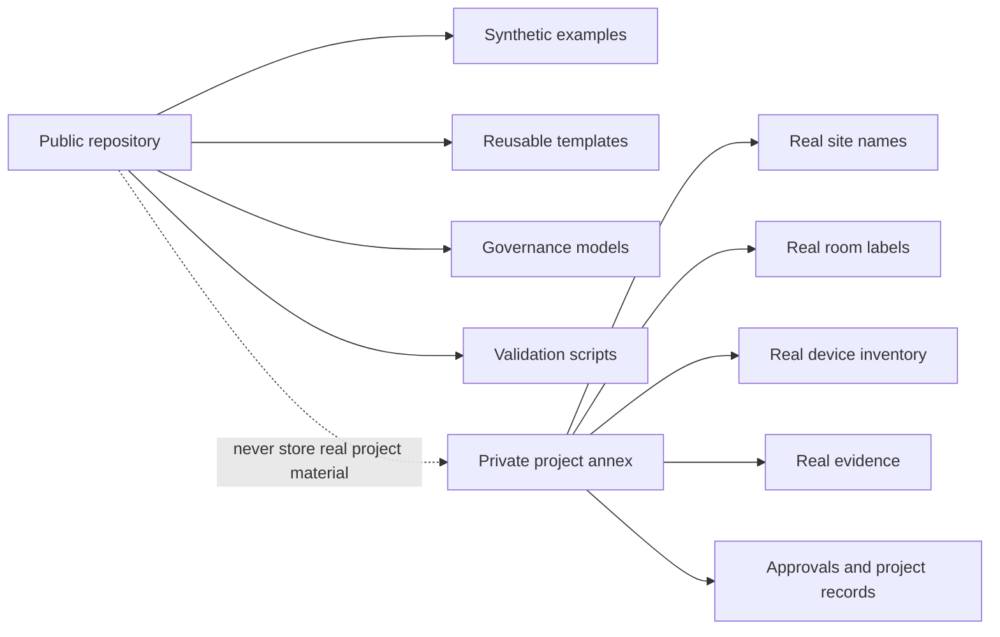
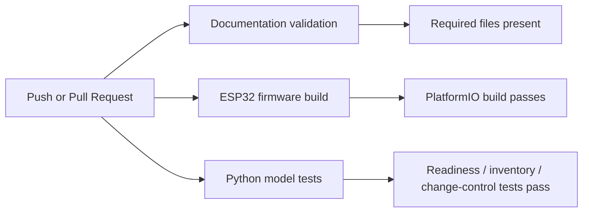
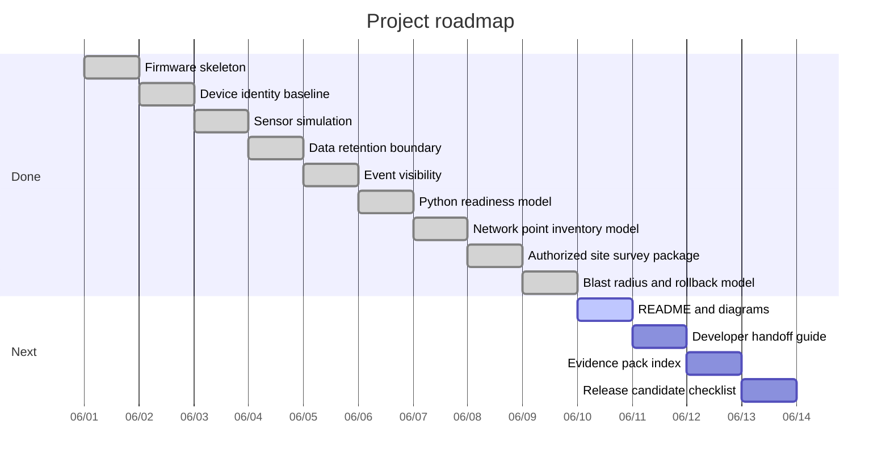

# ESP32 Edge Device Security & Authorized Site Readiness Governance Lab

**Governance-first lab for ESP32 edge-device security, authorized site readiness, network point documentation, rollback repeatability and audit evidence.**

This repository is a public portfolio and reference baseline. It is not a production firmware product, customer delivery package, classified project record or generic ESP32 tutorial.

The goal is to demonstrate how a small edge-device project can stay understandable, testable, reversible and evidence-driven without becoming an over-engineered enterprise process monster.

---

## What this repository demonstrates

| Area | Evidence |
| --- | --- |
| ESP32 firmware baseline | `platformio.ini`, `src/main.cpp`, local-only serial output |
| Device identity and configuration boundary | `include/lab_config.example.h`, `docs/DEVICE_IDENTITY_AND_CONFIGURATION.md` |
| Sensor data governance | synthetic local readings, `docs/SENSOR_DATA_GOVERNANCE.md` |
| Data retention boundary | volatile last reading only, `docs/DATA_RETENTION_BOUNDARY.md` |
| Event visibility | local serial events, `docs/EVENT_VISIBILITY_MODEL.md` |
| Readiness scoring | `models/readiness_model.py`, pytest |
| Network point documentation quality | `models/network_inventory_model.py` |
| Authorized site readiness package | site survey model, synthetic examples, evidence report |
| Blast radius and rollback repeatability | `models/change_control_model.py`, rollback docs, tests |
| KATAKRI-aligned public/private boundary | `docs/KATAKRI_ALIGNMENT.md`, `docs/PUBLIC_SCOPE.md` |
| CI validation | documentation validation, firmware build, Python model tests |

---

## Core principle

Small technical systems still need clear governance when they touch physical space, device identity, environmental data, network points, site readiness or regulated operating environments.

The project keeps the baseline intentionally safe:

```text
no real customer data
no real site details
no network scanning
no wireless discovery
no credential testing
no telemetry upload
no persistent sensor storage
no production-readiness claim
```

---

## High-level architecture



---

## Governance flow



---

## Blast radius and rollback flow



---

## Public/private boundary



---

## Current repository map

```text
docs/
  ARCHITECTURE.md
  THREAT_MODEL.md
  SECURITY_BASELINE.md
  DEVICE_LIFECYCLE.md
  OTA_AND_ROLLBACK.md
  PRIVACY_AND_TELEMETRY.md
  CHANGE_GOVERNANCE.md
  EVIDENCE_MODEL.md
  PRODUCTIZATION_MODEL.md
  ASSURANCE_CASE.md
  SUPPLIER_AND_COMPONENT_GOVERNANCE.md
  RELEASE_GOVERNANCE.md
  OPERATIONS_RUNBOOK.md
  PUBLIC_SCOPE.md
  KATAKRI_ALIGNMENT.md
  FIRMWARE_SECURITY_MODEL.md
  DEVICE_IDENTITY_AND_CONFIGURATION.md
  SENSOR_DATA_GOVERNANCE.md
  DATA_RETENTION_BOUNDARY.md
  EVENT_VISIBILITY_MODEL.md
  NETWORK_POINT_INVENTORY_MODEL.md
  AUTHORIZED_SITE_SURVEY_MODEL.md
  NETWORK_POINT_RECORD_SCHEMA.md
  BLAST_RADIUS_AND_ROLLBACK_MODEL.md
  ROLLBACK_REHEARSAL.md
  CHANGE_SIZE_GATES.md

include/
  lab_config.example.h
  sensor_simulation.h
  retention_policy.h
  audit_events.h

src/
  main.cpp

models/
  readiness_model.py
  network_inventory_model.py
  change_control_model.py
  README.md

tests/
  test_readiness_model.py
  test_network_inventory_model.py
  test_change_control_model.py

examples/
  esp32-wifi-sensor-change.md
  esp32-ota-update-change.md
  esp32-device-identity-change.md
  esp32-sensor-simulation-change.md
  esp32-data-retention-boundary-change.md
  building-network-point-survey.md
  shelter-readiness-assessment.md

evidence/
  EXAMPLE_VALIDATION_REPORT.md
  EXAMPLE_FIRMWARE_BASELINE_REPORT.md
  EXAMPLE_DEVICE_IDENTITY_REPORT.md
  EXAMPLE_SENSOR_SIMULATION_REPORT.md
  EXAMPLE_DATA_RETENTION_REPORT.md
  EXAMPLE_SITE_SURVEY_REPORT.md
  EXAMPLE_BLAST_RADIUS_ROLLBACK_REPORT.md

.github/workflows/
  validation.yml
  firmware-build.yml
  python-model-tests.yml
```

---

## Validation commands

Run the full local validation set:

```bash
bash scripts/validate-docs.sh
python models/readiness_model.py
python models/network_inventory_model.py
python models/change_control_model.py
python -m pytest tests/test_readiness_model.py tests/test_network_inventory_model.py tests/test_change_control_model.py
pio run
```

Expected documentation result:

```text
ESP32 IoT Security Governance Lab validation: PASSED
```

---

## CI workflows



---

## Roadmap



---

## Practical roadmap

| Phase | Goal | Status |
| --- | --- | --- |
| 1 | Documentation baseline | Done |
| 2 | Firmware skeleton | Done |
| 3 | Device identity/config boundary | Done |
| 4 | Sensor simulation | Done |
| 5 | Data retention boundary | Done |
| 6 | Event visibility | Done |
| 7 | Readiness and inventory Python models | Done |
| 8 | Authorized site survey package | Done |
| 9 | Blast radius / rollback repeatability | Done |
| 10 | README, diagrams and roadmap | Done |
| 11 | Developer handoff guide | Next |
| 12 | Evidence pack index | Next |
| 13 | Release candidate checklist | Next |

---

## Positioning

This repository can be described as:

> A governance-first ESP32 edge-device and authorized site-readiness lab demonstrating local firmware behavior, synthetic sensor data, retention boundaries, event visibility, readiness scoring, network point documentation quality, blast-radius control, rollback repeatability and KATAKRI-aligned public/private evidence boundaries.

Shorter version:

> Edge Device Security & Authorized Site Readiness Governance Lab.

---

## What this is not

This repository is not:

- a production ESP32 firmware product
- a customer site report
- a classified project record
- an automated network discovery tool
- a wireless discovery tool
- a penetration testing toolkit
- a drone-control project
- a medical decision system
- a certification claim

---

## License

MIT or project-specific license to be decided.
