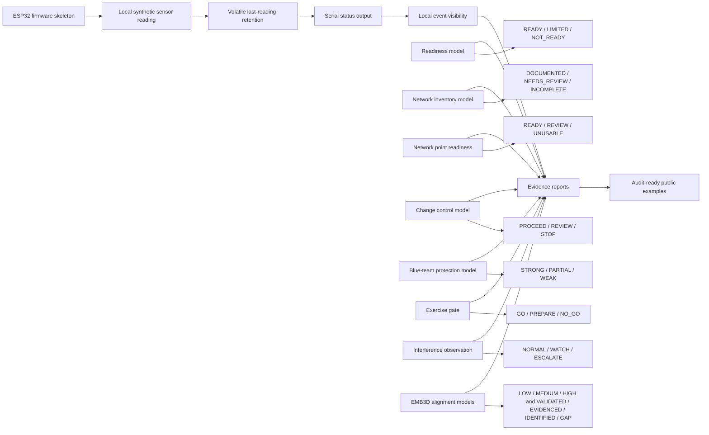
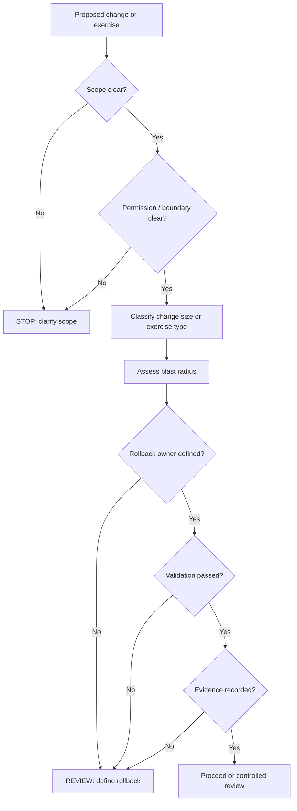
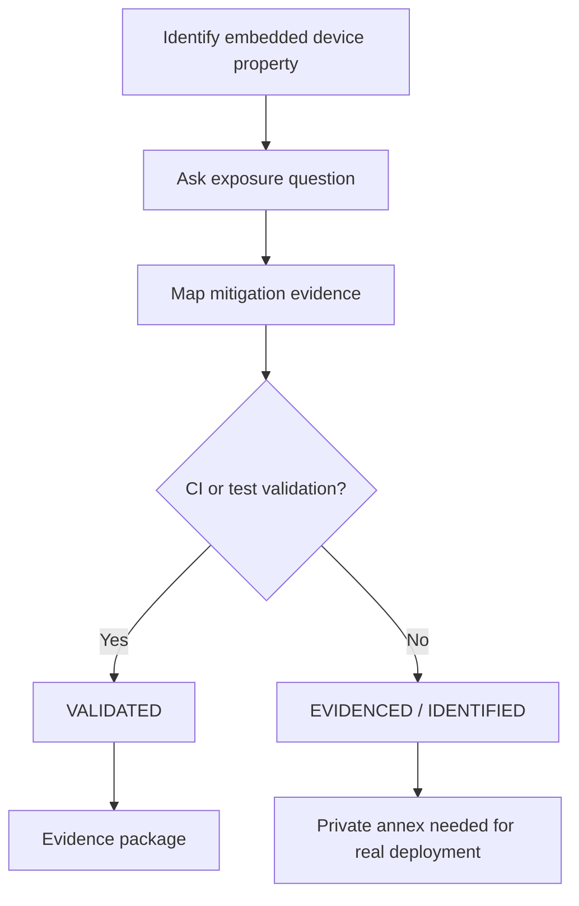
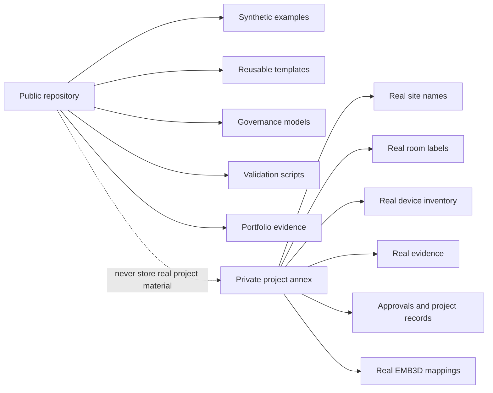
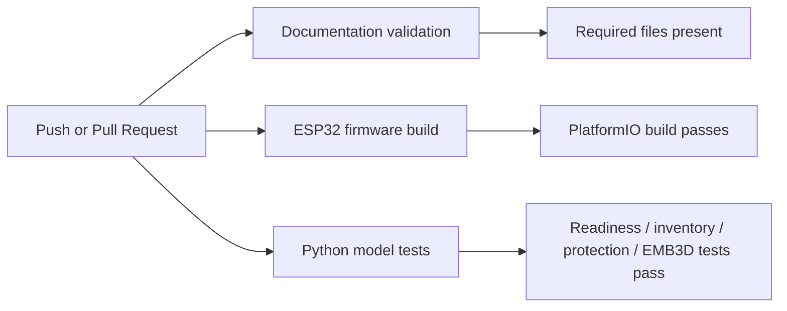

# ESP32 / Embedded Edge Device Security Governance Lab

**Governance-first lab for ESP32 and embedded edge-device security, readiness validation, network point inventory, defensive exercise gates, EMB3D-aligned threat-modeling evidence and KATAKRI-style public/private boundaries.**

This repository is a public portfolio and reference baseline. It is not a production firmware product, customer delivery package, classified project record, penetration testing toolkit, drone-control project or generic ESP32 tutorial.

The goal is to demonstrate how a small embedded/edge-device project can stay understandable, testable, reversible and evidence-driven without becoming an over-engineered enterprise process monster.

---

## Portfolio / author context

This repository is part of Jonne Silvennoinen's public GitHub portfolio:

- GitHub profile: [Jonnenpijonne](https://github.com/Jonnenpijonne)

The broader portfolio focuses on practical security governance, embedded/edge-device assurance, documentation-driven DevSecOps, evidence-based validation and controlled public/private project boundaries.

---

## Start here

| Resource | Purpose |
| --- | --- |
| `docs/QUICK_LOCAL_VALIDATION.md` | Copy-paste local validation path for Git Bash |
| `docs/GETTING_STARTED.md` | Local setup and validation commands |
| `docs/GATEHOUSE_INTEGRATION.md` | Lightweight integration model with Gatehouse change-governance validation |
| `docs/PROJECT_INDEX.md` | Project-level map |
| `wiki/Home.md` | Repository-versioned wiki landing page |
| `wiki/Model-Catalog.md` | Python model catalog |
| `wiki/Evidence-Pack.md` | Evidence examples |
| `wiki/License-and-Use.md` | License and intended-use summary |
| `docs/LICENSE_POLICY.md` | Apache-2.0 license policy |
| `NOTICE` | Project notice and attribution context |

---

## Validate in a temporary sandbox

Use this if you want to test the repository without keeping a permanent local copy.

Prerequisites:

- Git
- Git Bash on Windows, or another Bash-compatible shell
- Python 3.x
- Internet connection for dependency installation

No physical ESP32 board is required for this validation. The firmware build targets `esp32dev`, but this guide does not flash a device.

Copy and run this in Git Bash:

```bash
cd /tmp
rm -rf esp32-iot-security-governance-lab

git clone https://github.com/Jonnenpijonne/esp32-iot-security-governance-lab.git
cd esp32-iot-security-governance-lab

bash scripts/validate-docs.sh

python -m pytest \
  tests/test_readiness_model.py \
  tests/test_network_inventory_model.py \
  tests/test_network_point_model.py \
  tests/test_change_control_model.py \
  tests/test_vectorization_model.py \
  tests/test_model_package_gate.py \
  tests/test_blue_team_protection_model.py \
  tests/test_authorized_exercise_gate.py \
  tests/test_interference_observation_model.py \
  tests/test_emb3d_mapping_model.py \
  tests/test_emb3d_alignment_model.py

python -m pip install --upgrade platformio
python -m platformio --version
python -m platformio run
```

Expected result:

```text
Documentation validation: PASSED
Python tests: passed
PlatformIO firmware build: SUCCESS
Build artifacts: firmware.elf, firmware.bin
```

Optional cleanup:

```bash
cd /tmp
rm -rf esp32-iot-security-governance-lab
```

For the longer validation guide, see `docs/QUICK_LOCAL_VALIDATION.md`.

---

> **Wiki note:** this project uses a version-controlled `wiki/` directory inside the repository. It is not the separate GitHub Wiki tab. This keeps the wiki content in the same branch, commit history and validation flow as the rest of the project.

---

## What this repository demonstrates

| Area | Evidence |
| --- | --- |
| ESP32 firmware baseline | `platformio.ini`, `src/main.cpp`, local-only serial output |
| Device identity and configuration boundary | `include/lab_config.example.h`, `docs/DEVICE_IDENTITY_AND_CONFIGURATION.md` |
| Sensor data governance | synthetic local readings, `docs/SENSOR_DATA_GOVERNANCE.md` |
| Data retention boundary | volatile last reading only, `docs/DATA_RETENTION_BOUNDARY.md` |
| Event visibility | local serial events, `include/audit_events.h`, `docs/EVENT_VISIBILITY_MODEL.md` |
| Readiness scoring | `models/readiness_model.py`, pytest |
| Network point inventory quality | `models/network_inventory_model.py`, `docs/NETWORK_POINT_INVENTORY_MODEL.md` |
| Network point readiness review | `models/network_point_model.py`, `docs/NETWORK_POINT_READINESS.md` |
| Change control and rollback | `models/change_control_model.py`, rollback docs, tests |
| Vectorization / model package gate | `models/vectorization_model.py`, `models/model_package_gate.py` |
| Defensive exercise gate | `models/authorized_exercise_gate.py`, `docs/DEFENSIVE_EXERCISE_READINESS.md` |
| Blue-team protection scoring | `models/blue_team_protection_model.py`, `docs/BLUE_TEAM_PROTECTION_MODEL.md` |
| Interference observation | `models/interference_observation_model.py`, `docs/INTERFERENCE_OBSERVATION_MODEL.md` |
| MITRE EMB3D alignment layer | `docs/EMB3D_ALIGNMENT.md`, `docs/EMB3D_MAPPING_MODEL.md`, EMB3D models/tests |
| KATAKRI-aligned public/private boundary | `docs/KATAKRI_ALIGNMENT.md`, `docs/PUBLIC_SCOPE.md` |
| CI validation | documentation validation, firmware build, Python model tests |

---

## Core principle

Small technical systems still need clear governance when they touch physical space, device identity, environmental data, network points, readiness decisions, defensive validation, evidence records or regulated operating environments.

The project keeps the baseline intentionally safe:

```text
no real customer data
no real site details
no network scanning
no wireless discovery
no credential testing
no exploit logic
no interference generation
no telemetry upload
no persistent sensor storage
no production-readiness claim
no certification claim
```

---

## High-level architecture



---

## Governance flow



---

## EMB3D alignment flow



This repository does not copy the MITRE EMB3D dataset. It provides a lightweight public mapping layer that can be connected to real EMB3D references and private project annexes when needed.

---

## Public/private boundary



---

## Current repository map

```text
docs/
  QUICK_LOCAL_VALIDATION.md
  GETTING_STARTED.md
  GATEHOUSE_INTEGRATION.md
  PROJECT_INDEX.md
  LICENSE_POLICY.md
  ARCHITECTURE.md
  THREAT_MODEL.md
  SECURITY_BASELINE.md
  DEVICE_LIFECYCLE.md
  OTA_AND_ROLLBACK.md
  PRIVACY_AND_TELEMETRY.md
  CHANGE_GOVERNANCE.md
  EVIDENCE_MODEL.md
  PRODUCTIZATION_MODEL.md
  ASSURANCE_CASE.md
  SUPPLIER_AND_COMPONENT_GOVERNANCE.md
  RELEASE_GOVERNANCE.md
  OPERATIONS_RUNBOOK.md
  PUBLIC_SCOPE.md
  KATAKRI_ALIGNMENT.md
  FIRMWARE_SECURITY_MODEL.md
  DEVICE_IDENTITY_AND_CONFIGURATION.md
  SENSOR_DATA_GOVERNANCE.md
  DATA_RETENTION_BOUNDARY.md
  EVENT_VISIBILITY_MODEL.md
  NETWORK_POINT_INVENTORY_MODEL.md
  NETWORK_POINT_READINESS.md
  DEFENSIVE_EXERCISE_READINESS.md
  BLUE_TEAM_PROTECTION_MODEL.md
  INTERFERENCE_OBSERVATION_MODEL.md
  EMB3D_ALIGNMENT.md
  EMB3D_MAPPING_MODEL.md

wiki/
  Home.md
  Project-Overview.md
  Architecture.md
  Validation-Guide.md
  Security-Boundary.md
  EMB3D-Alignment.md
  Model-Catalog.md
  Evidence-Pack.md
  License-and-Use.md

include/
  lab_config.example.h
  sensor_simulation.h
  retention_policy.h
  audit_events.h

src/
  main.cpp

models/
  readiness_model.py
  network_inventory_model.py
  network_point_model.py
  change_control_model.py
  vectorization_model.py
  model_package_gate.py
  blue_team_protection_model.py
  authorized_exercise_gate.py
  interference_observation_model.py
  emb3d_mapping_model.py
  emb3d_alignment_model.py
  README.md

tests/
  test_readiness_model.py
  test_network_inventory_model.py
  test_network_point_model.py
  test_change_control_model.py
  test_vectorization_model.py
  test_model_package_gate.py
  test_blue_team_protection_model.py
  test_authorized_exercise_gate.py
  test_interference_observation_model.py
  test_emb3d_mapping_model.py
  test_emb3d_alignment_model.py

examples/
  esp32-wifi-sensor-change.md
  esp32-ota-update-change.md
  esp32-device-identity-change.md
  esp32-sensor-simulation-change.md
  esp32-data-retention-boundary-change.md
  network-point-readiness-review.md
  emb3d-property-alignment-review.md

evidence/
  EXAMPLE_VALIDATION_REPORT.md
  EXAMPLE_FIRMWARE_BASELINE_REPORT.md
  EXAMPLE_DEVICE_IDENTITY_REPORT.md
  EXAMPLE_SENSOR_SIMULATION_REPORT.md
  EXAMPLE_DATA_RETENTION_REPORT.md
  EXAMPLE_EMB3D_ALIGNMENT_REPORT.md

.gatehouse/
  embedded-security-profile.yml
  change-template.md

changes/
  example-embedded-security-boundary-change.md

tools/
  gatehouse_embedded_check.py

.github/workflows/
  validation.yml
  firmware-build.yml
  python-model-tests.yml
  gatehouse-embedded-quality-gate.yml
```

---

## Validation commands

Run the full local validation set:

```bash
bash scripts/validate-docs.sh

python models/readiness_model.py
python models/network_inventory_model.py
python models/network_point_model.py
python models/change_control_model.py
python models/vectorization_model.py
python models/model_package_gate.py
python models/blue_team_protection_model.py
python models/authorized_exercise_gate.py
python models/interference_observation_model.py
python models/emb3d_mapping_model.py
python models/emb3d_alignment_model.py

python -m pytest \
  tests/test_readiness_model.py \
  tests/test_network_inventory_model.py \
  tests/test_network_point_model.py \
  tests/test_change_control_model.py \
  tests/test_vectorization_model.py \
  tests/test_model_package_gate.py \
  tests/test_blue_team_protection_model.py \
  tests/test_authorized_exercise_gate.py \
  tests/test_interference_observation_model.py \
  tests/test_emb3d_mapping_model.py \
  tests/test_emb3d_alignment_model.py

pio run
```

For a copy-paste Git Bash validation path, see:

```text
docs/QUICK_LOCAL_VALIDATION.md
```

Expected documentation result:

```text
ESP32 IoT Security Governance Lab validation: PASSED
```

---

## Validation evidence

Latest local validation result:

| Check | Result |
| --- | --- |
| Documentation validation | PASSED |
| Python model tests | 38 passed |
| PlatformIO ESP32 firmware build | SUCCESS |
| Target board | `esp32dev` |
| Build artifacts | `firmware.elf`, `firmware.bin` |
| RAM usage | 6.6% |
| Flash usage | 20.5% |
| Repository status | clean |

This evidence shows that the repository is not only documented, but also locally validated through documentation checks, Python model tests and an ESP32 firmware build.

---

## CI workflows



---

## Practical roadmap

| Phase | Goal | Status |
| --- | --- | --- |
| 1 | Documentation baseline | Done |
| 2 | Firmware skeleton | Done |
| 3 | Device identity/config boundary | Done |
| 4 | Sensor simulation | Done |
| 5 | Data retention boundary | Done |
| 6 | Event visibility | Done |
| 7 | Readiness and inventory Python models | Done |
| 8 | Network point readiness | Done |
| 9 | Blast radius / rollback repeatability | Done |
| 10 | Vectorization / model package gate | Done |
| 11 | Defensive exercise gate | Done |
| 12 | Blue-team protection scoring | Done |
| 13 | Interference observation | Done |
| 14 | EMB3D alignment layer | Done |
| 15 | README and project-level instructions | Done |
| 16 | Apache-2.0 licensing and NOTICE | Done |
| 17 | Version-controlled repository wiki | Done |
| 18 | Release candidate checklist | Next |
| 19 | Portfolio landing-page summary | Next |

---

## Positioning

This repository can be described as:

> A governance-first ESP32 / embedded edge-device security lab demonstrating local firmware behavior, synthetic sensor data, retention boundaries, event visibility, readiness scoring, network point inventory, defensive exercise gates, interference observation, EMB3D-aligned threat-modeling evidence and KATAKRI-style public/private boundaries.

Short version:

> Embedded Edge Device Security Governance Lab.

Portfolio version:

> Public, synthetic ESP32 / embedded edge-device security governance lab for regulated environments: firmware baseline, device identity, sensor data governance, readiness scoring, network point inventory, blue-team protection scoring, authorized exercise gates, interference observation and EMB3D-aligned evidence validation.

---

## What this is not

This repository is not:

- a production ESP32 firmware product
- a customer site report
- a classified project record
- an automated network discovery tool
- a wireless discovery tool
- a penetration testing toolkit
- an exploit repository
- a drone-control project
- a medical decision system
- a certification claim

---

## License

Apache License, Version 2.0.

See:

- `LICENSE`
- `NOTICE`
- `docs/LICENSE_POLICY.md`
- `wiki/License-and-Use.md`
