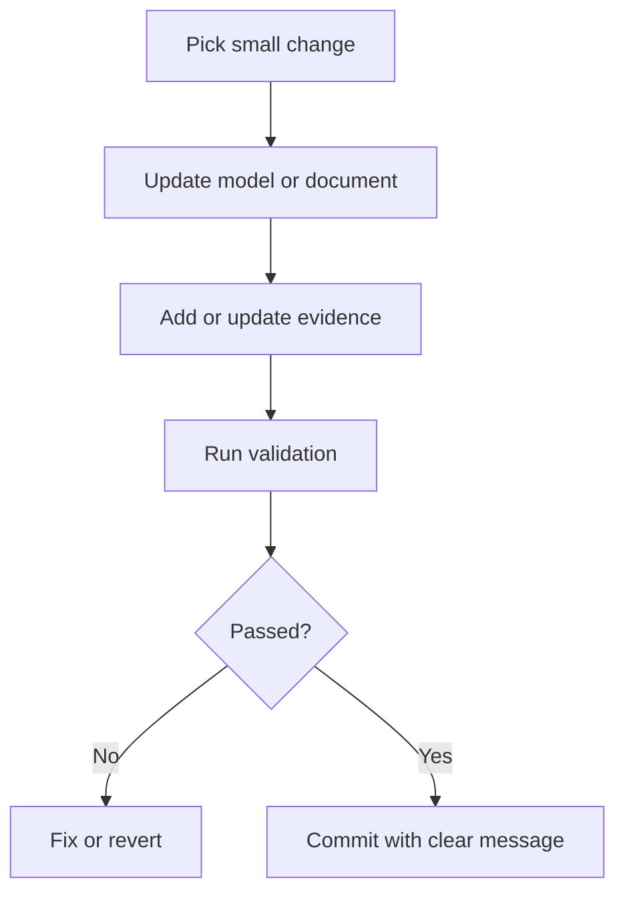

# Developer Handoff

This document explains how to work on the repository without losing the governance boundary.

## Project in one sentence

This is a public ESP32 edge-device security and authorized site-readiness governance lab with synthetic examples, validation scripts, firmware skeleton, Python models and evidence templates.

## First commands

```bash
git pull
bash scripts/validate-docs.sh
python models/readiness_model.py
python models/network_inventory_model.py
python models/change_control_model.py
python -m pytest tests/test_readiness_model.py tests/test_network_inventory_model.py tests/test_change_control_model.py
pio run
```

## Working rule

Before changing anything, identify:

- What file changes.
- What evidence changes.
- What validation proves it.
- What rollback returns it to the previous state.
- Whether the public/private boundary remains intact.

## Safe change pattern



## Public repository boundary

Allowed:

- Synthetic examples.
- Generic templates.
- Public governance models.
- Local-only firmware behavior.
- Tests and validation scripts.

Not allowed:

- Real customer material.
- Real site names.
- Real room labels.
- Real device inventory.
- Real credentials.
- Real protected environment evidence.

## Commit style

Use clear commit messages such as:

```text
Add rollback rehearsal evidence
Update site survey examples
Require release checklist in validation
```

## Definition of done

A change is done when:

- Files are added or updated.
- Evidence exists where relevant.
- Validation passes.
- Rollback path is obvious.
- README or roadmap is updated if the project shape changes.
