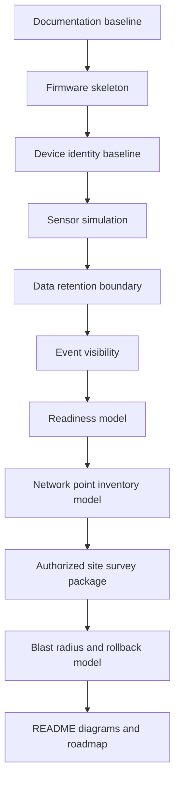

# Roadmap

This roadmap keeps the project understandable for future contributors.

## Current status

## Done

| Area | Status |
| --- | --- |
| Firmware skeleton | Done |
| Device identity baseline | Done |
| Sensor simulation | Done |
| Data retention boundary | Done |
| Event visibility | Done |
| Python readiness model | Done |
| Network point inventory model | Done |
| Authorized site survey package | Done |
| Blast radius and rollback model | Done |
| README diagrams | Done |

## Next work

| Priority | Work item | Purpose |
| --- | --- | --- |
| 1 | Developer handoff guide | Help new contributors understand how to work safely |
| 2 | Evidence pack index | Make all evidence files easier to navigate |
| 3 | Release candidate checklist | Define what must pass before tagging a release |
| 4 | Local dry-run scenario | Show one end-to-end synthetic review flow |
| 5 | Public/private annex template | Clarify what belongs outside the public repo |

## Do not add yet

- Real site data.
- Real device inventory.
- Real network discovery.
- Wireless discovery.
- Credential testing.
- Production deployment logic.
- Complex service framework.

## Principle

Add only the smallest layer that improves clarity, validation, rollback or evidence.
